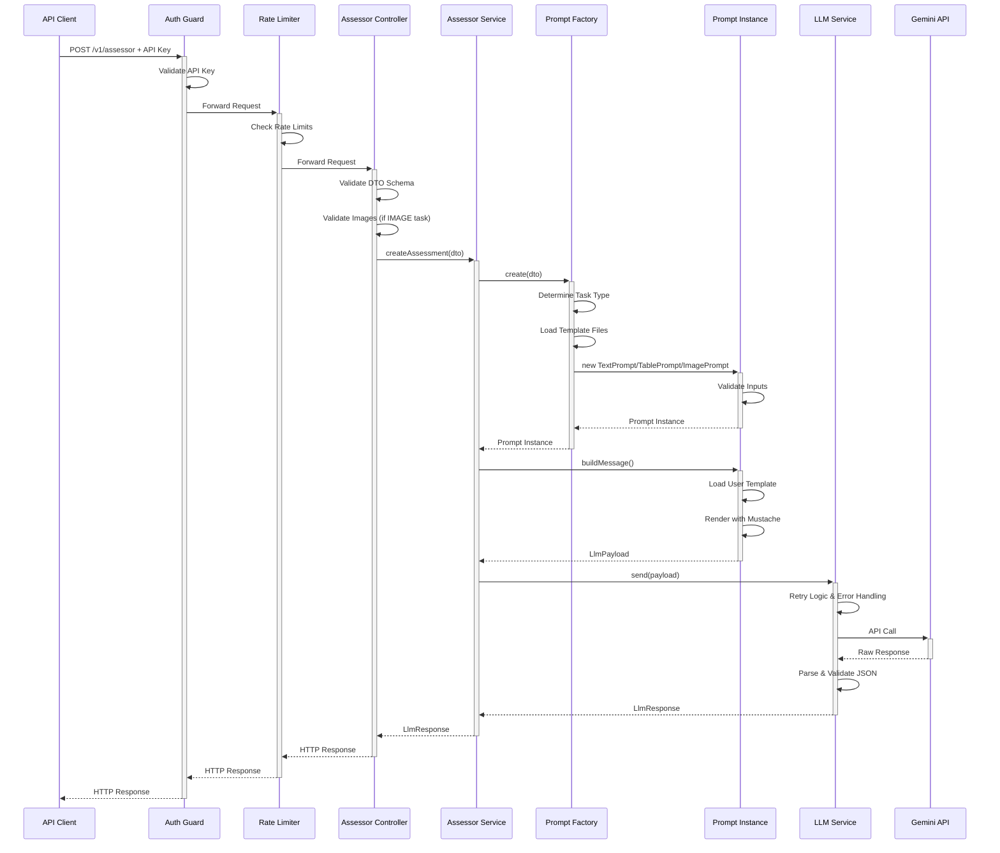

# Data Flow

This document describes the complete request/response flow through the AssessmentBot-Backend system, from initial HTTP request to final LLM response.

## Overview

The data flow follows a layered architecture with clear separation between HTTP handling, business logic, prompt generation, and LLM integration. Each layer is responsible for specific transformations and validations.



## Detailed Flow Analysis

### 1. Request Entry Point

**Endpoint**: `POST /v1/assessor`

**Initial Processing**:

- HTTP request received by NestJS application
- Express middleware processes the request
- Logging middleware captures request details with sensitive data redaction

### 2. Security Layer

#### Authentication (`ApiKeyGuard`)

```typescript
// Location: src/auth/api-key.guard.ts
1. Extract Bearer token from Authorization header
2. Validate token against configured API keys
3. Set user context if valid
4. Reject with 401 if invalid
```

#### Rate Limiting (`ThrottlerGuard`)

```typescript
// Location: Global configuration in app.module.ts
1. Check request count against time window
2. Authenticated endpoints: 90 requests per 10 seconds
3. Apply exponential backoff if limits exceeded
4. Return 429 Too Many Requests if exceeded
```

### 3. Controller Layer

**Location**: `src/v1/assessor/assessor.controller.ts`

#### Input Validation

```typescript
// Schema validation using ZodValidationPipe
1. Validate request body against createAssessorDtoSchema
2. Ensure required fields are present
3. Validate task type (TEXT, TABLE, IMAGE)
4. Perform task-specific validation
```

#### Image-Specific Validation (for IMAGE tasks)

```typescript
// Additional validation for image tasks
1. Validate image format and MIME type
2. Check file size against MAX_IMAGE_UPLOAD_SIZE_MB
3. Validate base64 encoding integrity
4. Ensure image data is processable
```

**DTO Structure**:

```typescript
interface CreateAssessorDto {
  taskType: 'TEXT' | 'TABLE' | 'IMAGE';
  // For TEXT/TABLE, these are strings.
  // For IMAGE, these can be base64 strings or Buffer instances.
  reference: string | Buffer;
  template: string | Buffer;
  studentResponse: string | Buffer;
  // Optional fields for IMAGE task type
  images?: { path: string; mimeType: string }[];
  systemPromptFile?: string;
}
```

### 4. Service Layer

**Location**: `src/v1/assessor/assessor.service.ts`

The service orchestrates the assessment workflow:

```typescript
async createAssessment(dto: CreateAssessorDto): Promise<LlmResponse> {
  1. const prompt = await this.promptFactory.create(dto);
  2. const message = await prompt.buildMessage();
  3. return this.llmService.send(message);
}
```

### 5. Prompt Generation Layer

**Location**: `src/prompt/prompt.factory.ts`

#### Factory Pattern Implementation

```typescript
1. Extract input data from DTO
2. Determine prompt template files based on task type:
   - TEXT: text.system.prompt.md + text.user.prompt.md
   - TABLE: table.system.prompt.md + table.user.prompt.md
   - IMAGE: image.system.prompt.md (no user template)
3. Load system prompt from markdown file
4. Instantiate appropriate prompt class:
   - TextPrompt for TEXT tasks
   - TablePrompt for TABLE tasks
   - ImagePrompt for IMAGE tasks
```

#### Prompt Instance Creation

**Location**: `src/prompt/prompt.base.ts`

```typescript
1. Validate inputs against PromptInputSchema
2. Store reference task, student task, and empty task
3. Set template file names and system prompt
4. Log input lengths for monitoring
```

### 6. Message Building

#### Text/Table Tasks

```typescript
// Location: src/prompt/prompt.base.ts - buildMessage()
1. Load user template from markdown file
2. Render template using Mustache with variables:
   - {{referenceTask}}: Reference solution
   - {{studentTask}}: Student's response
   - {{emptyTask}}: Original task prompt
3. Return StringPromptPayload:
   {
     system: "System instructions...",
     user: "Rendered user prompt...",
     temperature?: number
   }
```

#### Image Tasks

```typescript
// Location: src/prompt/image.prompt.ts - buildMessage()
1. No user template rendering required
2. Convert base64 data to image objects
3. Return ImagePromptPayload:
   {
     system: "System instructions...",
     images: [
       { mimeType: "image/png", data: "base64..." },
       // ... more images
     ],
     messages: [{ content: "Assessment prompt" }],
     temperature?: number
   }
```

### 7. LLM Integration Layer

**Location**: `src/llm/llm.service.interface.ts` & `src/llm/gemini.service.ts`

#### Retry Logic and Error Handling

```typescript
// Base LLMService provides retry functionality
1. Attempt LLM API call
2. If rate limit error (429):
   - Calculate exponential backoff delay
   - Retry up to LLM_MAX_RETRIES times
   - Wait LLM_BACKOFF_BASE_MS * 2^attempt milliseconds
3. If resource exhausted error:
   - Throw ResourceExhaustedError immediately (no retry)
4. If other errors:
   - Wrap in generic error with context
```

#### Gemini Service Implementation

```typescript
1. Select model based on payload type:
   - Text/Table: gemini-2.5-flash-lite
   - Image: gemini-2.5-flash-lite
2. Build model parameters with system instruction and temperature
3. Create content array (text or text + images)
4. Make API call to Google Gemini
5. Extract text from response
6. Parse and repair JSON if needed
7. Validate against LlmResponseSchema
```

### 8. Response Processing

#### JSON Parsing and Repair

**Location**: `src/common/json-parser.util.ts`

```typescript
1. Attempt standard JSON.parse()
2. If fails, try extraction patterns:
   - Remove surrounding markdown code blocks
   - Trim extra brackets or characters
   - Extract JSON from text patterns
3. If still fails, use jsonrepair library
4. Validate final structure
```

#### Response Validation

**Location**: `src/llm/types.ts`

```typescript
// Expected LLM response structure
interface LlmResponse {
  completeness: {
    score: number; // 0-5
    reasoning: string; // Non-empty explanation
  };
  accuracy: {
    score: number; // 0-5
    reasoning: string; // Non-empty explanation
  };
  spag: {
    // Spelling, Punctuation, Grammar
    score: number; // 0-5
    reasoning: string; // Non-empty explanation
  };
}
```

### 9. Response Delivery

#### Controller Response

```typescript
1. Receive validated LlmResponse from service
2. NestJS automatically serialises to JSON
3. Return HTTP 200 with assessment results
```

#### Error Responses

```typescript
// Various error conditions with appropriate HTTP status codes
- 400 Bad Request: Validation failures, malformed input
- 401 Unauthorised: Invalid or missing API key
- 429 Too Many Requests: Rate limit exceeded
- 500 Internal Server Error: LLM failures, parsing errors
- 503 Service Unavailable: Resource exhausted errors
```

## Data Transformations

### Input Data Flow

```
HTTP Request Body (JSON)
    ↓ ZodValidationPipe
CreateAssessorDto (Validated)
    ↓ PromptFactory
PromptInput (Structured)
    ↓ Prompt.buildMessage()
LlmPayload (Template-rendered)
    ↓ GeminiService
Gemini API Request (Formatted)
```

### Output Data Flow

```
Gemini API Response (Raw text)
    ↓ JsonParserUtil
Parsed JSON Object
    ↓ LlmResponseSchema validation
LlmResponse (Validated)
    ↓ HTTP Response
Client JSON Response
```

## Error Handling Flow

### Validation Errors


### LLM Errors


## Performance Considerations

### Bottlenecks

1. **LLM API Latency**: Primary bottleneck (1-10 seconds per request)
2. **Image Processing**: Base64 decoding and validation for large images
3. **Template Rendering**: File I/O and Mustache processing
4. **JSON Parsing**: Complex parsing and repair operations

### Optimisations

1. **Connection Pooling**: HTTP clients maintain persistent connections
2. **Template Caching**: Markdown templates could be cached (not currently implemented)
3. **Validation Short-circuiting**: Early validation failures prevent expensive operations
4. **Streaming**: Not currently implemented but could improve response times

---

_For architectural context, see [Architecture Overview](overview.md) and [Module Responsibilities](modules.md)._
