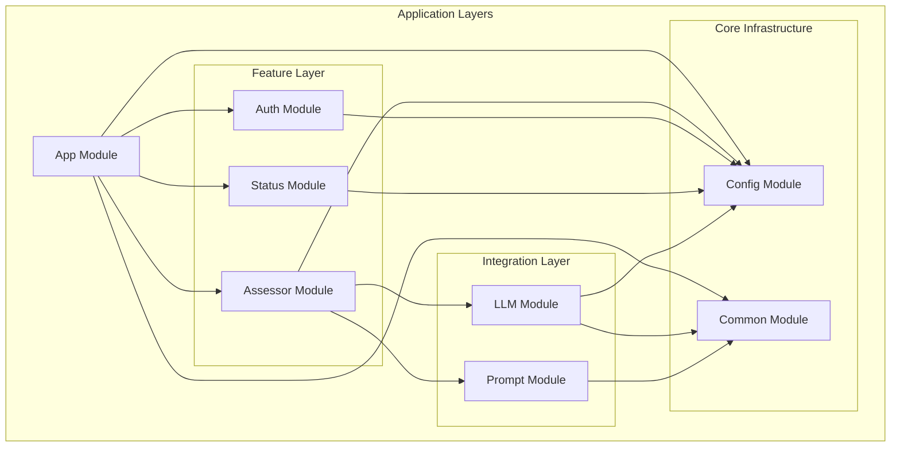

# Module Responsibilities

This document provides a detailed breakdown of each module in the AssessmentBot-Backend system, including their responsibilities, dependencies, and key components.

## Core Modules

### App Module (`src/app.module.ts`)

**Primary Responsibility**: Root module orchestration and global configuration

**Key Features**:

- Global dependency injection setup
- Logging configuration with `nestjs-pino`
- Global throttling (rate limiting) configuration
- Module composition and wiring

**Dependencies**:

- `ConfigModule`: Environment configuration
- `LoggerModule`: Structured logging setup
- `ThrottlerModule`: Rate limiting middleware
- All feature modules (AuthModule, AssessorModule, StatusModule)

**Providers**:

- `ThrottlerGuard`: Global rate limiting guard

**Configuration**:

- Conditional logging setup for development vs E2E testing
- Request logging with redaction for sensitive data
- Global throttling rules applied to all routes

---

### Config Module (`src/config/config.module.ts`)

**Primary Responsibility**: Centralised configuration management and validation

**Key Features**:

- Environment variable loading and validation using Zod schemas
- Type-safe configuration access throughout the application
- Separation from NestJS's built-in configuration module

**Dependencies**:

- `@nestjs/config`: Underlying configuration loading
- `zod`: Schema validation

**Providers**:

- `ConfigService`: Custom configuration service with validation

**Exports**:

- `ConfigService`: Available to all modules requiring configuration

**Architecture Pattern**:

- Boundary pattern: Acts as a facade over NestJS's configuration system
- Single source of truth for all configuration validation rules

---

### Common Module (`src/common/common.module.ts`)

**Primary Responsibility**: Shared utilities and cross-cutting concerns

**Key Components**:

- `JsonParserUtil`: Robust JSON parsing with repair capabilities
- `ZodValidationPipe`: Input validation using Zod schemas
- `ImageValidationPipe`: Specialised image file validation
- `HttpExceptionFilter`: Global exception handling
- `FileUtils`: File system utilities with ESM/CommonJS compatibility
- `LogRedactor`: Sensitive data redaction for logging
- `TypeGuards`: Runtime type checking utilities

**Dependencies**:

- `zod`: Schema validation
- `jsonrepair`: JSON parsing and repair
- `file-type`: File type detection

**Exports**:

- All utility classes and services for use across modules

---

## Feature Modules

### Assessor Module (`src/v1/assessor/assessor.module.ts`)

**Primary Responsibility**: Core assessment functionality (API version 1)

**Key Features**:

- HTTP endpoints for creating assessments
- Business logic orchestration for assessment workflows
- Integration between prompt generation and LLM services

**Dependencies**:

- `ConfigModule`: Configuration access
- `LlmModule`: LLM service integration
- `PromptModule`: Prompt generation services

**Components**:

- `AssessorController`: HTTP request handling with authentication and throttling
- `AssessorService`: Business logic for assessment creation

**API Endpoints**:

- `POST /v1/assessor`: Create new assessments

**Security**:

- Protected by `ApiKeyGuard`
- Custom throttling configuration for authenticated endpoints

---

### Auth Module (`src/auth/auth.module.ts`)

**Primary Responsibility**: Authentication and authorisation

**Key Features**:

- API key-based authentication using Bearer tokens
- Passport.js integration for authentication strategies
- Route protection via guards

**Dependencies**:

- `@nestjs/passport`: Authentication framework
- `passport-http-bearer`: Bearer token strategy
- `ConfigModule`: Configuration for API keys

**Components**:

- `ApiKeyStrategy`: Passport strategy for API key validation
- `ApiKeyGuard`: Route protection guard
- `ApiKeyService`: API key management and validation logic

**Exports**:

- All authentication components for use by feature modules

**Security Model**:

- Stateless authentication
- API keys validated against environment configuration
- No session storage or user management

---

### Status Module (`src/status/status.module.ts`)

**Primary Responsibility**: Application health monitoring and diagnostics

**Key Features**:

- Health check endpoints
- Application status reporting
- Diagnostic capabilities for monitoring

**Dependencies**:

- `ConfigModule`: Configuration access

**Components**:

- `StatusController`: Health check HTTP endpoints
- `StatusService`: Health check business logic

**Exports**:

- `StatusService`: Available for internal health monitoring

---

## Integration Modules

### LLM Module (`src/llm/llm.module.ts`)

**Primary Responsibility**: Large Language Model integration abstraction

**Key Features**:

- Abstract service interface for LLM providers
- Concrete implementation for Google Gemini
- Retry logic and error handling for LLM API calls
- Response validation and parsing

**Dependencies**:

- `ConfigModule`: API keys and configuration
- `CommonModule`: JSON parsing utilities

**Components**:

- `LLMService`: Abstract base class defining LLM interface
- `GeminiService`: Concrete implementation for Google Gemini API
- `ResourceExhaustedError`: Specialised error for quota limits
- `LlmResponse`: Type definitions for LLM responses

**Architecture Pattern**:

- Strategy pattern: Abstract service allows multiple LLM providers
- Provider pattern: Dependency injection maps interface to implementation

**Error Handling**:

- Exponential backoff retry for rate limits
- Resource exhaustion detection
- Robust JSON parsing with repair capabilities

---

### Prompt Module (`src/prompt/prompt.module.ts`)

**Primary Responsibility**: Prompt generation and template management

**Key Features**:

- Factory pattern for creating task-specific prompts
- Template-based prompt generation using Mustache
- Support for multiple content types (text, images, tables)

**Dependencies**:

- `@nestjs/common`: Logger service

**Components**:

- `PromptFactory`: Factory for creating prompt instances
- `Prompt`: Abstract base class for all prompt types
- `TextPrompt`: Text-based assessment prompts
- `ImagePrompt`: Image-based assessment prompts
- `TablePrompt`: Table-based assessment prompts

**Architecture Pattern**:

- Factory pattern: Creates appropriate prompt types based on input
- Template Method pattern: Base class defines common behaviour
- Strategy pattern: Different prompt types for different task types

**Template System**:

- Markdown-based template files
- Mustache templating engine for variable substitution
- Validation of prompt inputs using Zod schemas

---

## Module Dependency Graph

## Cross-Cutting Concerns

### Logging

- Implemented via `nestjs-pino` at the App Module level
- Request/response logging with sensitive data redaction
- Structured JSON logging for production
- Pretty-printed logs for development

### Validation

- Zod schemas used throughout for runtime validation
- Custom validation pipes in Common Module
- Environment variable validation in Config Module
- LLM response validation in LLM Module

### Error Handling

- Global exception filter in Common Module
- Structured error responses
- Specific error types for different failure modes
- Proper HTTP status code mapping

### Rate Limiting

- Global throttling configuration in App Module
- Endpoint-specific overrides in feature modules
- Different limits for authenticated vs unauthenticated requests

---

_For visual class relationships, see the [Class Structure](../design/ClassStructure.md) diagram._
