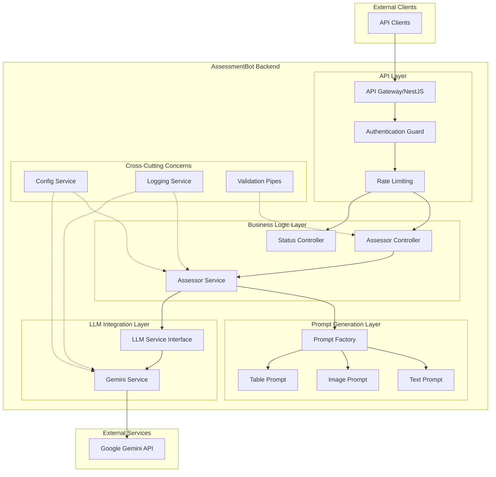
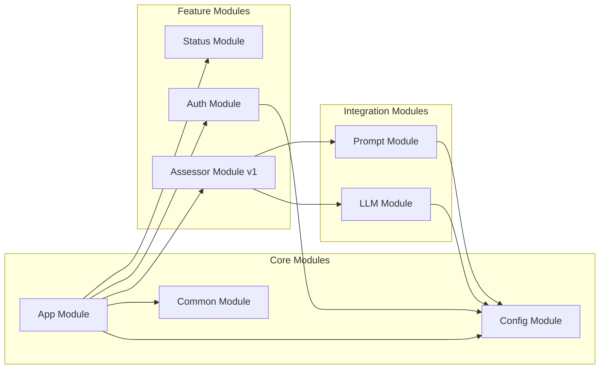

# Architecture Overview

This document provides a comprehensive overview of the AssessmentBot-Backend architecture, a NestJS-based API service that leverages Large Language Models (LLMs) to provide automated assessment services for educational content.

## High-Level Architecture

### Key Components and Responsibilities

| Component                | Responsibility                                               |
| ------------------------ | ------------------------------------------------------------ |
| **API Gateway**          | Request routing, middleware orchestration, and HTTP handling |
| **Authentication Guard** | API key validation and authorisation                         |
| **Rate Limiting**        | Request throttling for abuse prevention                      |
| **Assessor Service**     | Core business logic orchestration                            |
| **Prompt Factory**       | Task-specific prompt generation                              |
| **LLM Service**          | Abstract interface for LLM providers                         |
| **Gemini Service**       | Google Gemini API integration                                |
| **Config Service**       | Environment configuration management                         |

## External Dependencies

The system integrates with the following external services:

- **Google Gemini API**: Primary LLM provider for content assessment
- **Environment Configuration**: File-based and environment variable configuration
- **HTTP Clients**: For external API communication

## Module Architecture

The application follows NestJS module architecture with clear separation of concerns:

### Dependency Injection Patterns

The system uses NestJS's built-in dependency injection container with the following patterns:

- **Constructor Injection**: Primary pattern for service dependencies
- **Provider Registration**: Services registered in module `providers` arrays
- **Interface Segregation**: Abstract base classes for LLM services
- **Factory Pattern**: Used for prompt creation based on task types

## Design Principles

### SOLID Principles Implementation

- **Single Responsibility**: Each service has a focused, single purpose
- **Open/Closed**: LLM service abstraction allows new providers without modification
- **Liskov Substitution**: All prompt types can be used interchangeably
- **Interface Segregation**: Clean abstractions between layers
- **Dependency Inversion**: Depends on abstractions, not concrete implementations

### Security-First Approach

- **API Key Authentication**: Mandatory authentication for all assessment endpoints
- **Input Validation**: Zod schema validation for all inputs
- **Rate Limiting**: Global and endpoint-specific throttling
- **Environment Isolation**: Strict environment variable validation
- **Stateless Design**: No server-side session storage

### Separation of Concerns

- **Controller Layer**: HTTP request/response handling only
- **Service Layer**: Business logic implementation
- **Integration Layer**: External service communication
- **Validation Layer**: Input sanitisation and validation

## Technology Stack

### Runtime and Framework

- **Node.js (22-alpine)**: JavaScript runtime environment
- **Node.js 22**: JavaScript runtime environment (Debian-based)
- **NestJS**: Progressive Node.js framework for building scalable applications
- **TypeScript**: Strongly typed programming language
- **Express.js**: Underlying HTTP server framework

### Validation and Configuration

- **Zod**: TypeScript-first schema validation library
- **dotenv**: Environment variable loading
- **Custom ConfigService**: Centralised configuration management

### Authentication and Security

- **Passport.js**: Authentication middleware
- **passport-http-bearer**: Bearer token strategy for API keys
- **Throttler**: Rate limiting middleware

### LLM Integration

- **jsonrepair**: Robust JSON parsing for LLM responses
- **Mustache**: Template engine for prompt generation

### Testing and Development

- **Jest**: Testing framework
- **SuperTest**: HTTP assertion library for E2E tests
- **ESLint**: Code linting and style enforcement
- **Prettier**: Code formatting

### Observability

- **nestjs-pino**: Structured logging with Pino
- **pino-pretty**: Development log formatting

## Scalability Considerations

### Stateless Design

The application is completely stateless, enabling:

- Horizontal scaling across multiple instances
- Load balancing without session affinity
- Container-based deployment strategies

### Performance Optimisation

- **Connection Pooling**: HTTP clients maintain connection pools
- **Rate Limiting**: Prevents resource exhaustion
- **Lazy Loading**: Modules and services loaded on-demand
- **Efficient Validation**: Zod schema validation with early exit

### Bottleneck Identification

Primary performance bottlenecks:

1. **LLM API Calls**: Network latency and processing time
2. **Image Processing**: Large file validation and processing
3. **JSON Parsing**: LLM response parsing and validation

### Deployment Architecture

The system is designed for containerised deployment:

- **Docker Support**: Multi-stage Docker builds
- **Environment Isolation**: Configuration via environment variables
- **Health Checks**: Built-in status endpoints for monitoring
- **Graceful Shutdown**: Proper resource cleanup on termination

---

_For detailed class relationships, see the [Class Structure](../design/ClassStructure.md) diagram._

## Guiding Principles

1. **Security**: Always prioritise security in your code. Validate inputs, sanitise outputs, and handle sensitive data with care. This includes using environment variables for configuration and secrets, and ensuring that any user-generated content is properly escaped to prevent XSS attacks.
   - Use structured logging for all authentication attempts and errors, leveraging NestJS's built-in Logger or a compatible logging library. Ensure logs include enough detail (e.g., IP address, timestamp, reason for failure) to support external tools like fail2ban for automated blocking of malicious IPs.
2. **Ephemerality**: Design the system to be stateless. Assessment Bot prioritises privacy above all else. No student PII is should even be sent to the backend. Maintaining statelessness ensures that any inadvertent data leaks persist only as long as the request is being processed.
3. **Performance**: Write efficient code that minimises resource usage. Use asynchronous programming patterns to handle I/O operations without blocking the event loop.
4. **Use well-maintained libraries**: Avoid reinventing the wheel. Use well-maintained libraries and frameworks that are widely adopted in the Node.js ecosystem. This includes libraries for routing, database access, and validation.
5. **Modularity**: Structure the code in a modular way to promote reusability and maintainability. Use TypeScript interfaces and types to define clear contracts for modules.
6. **TDD**: Write tests for your code. Use a test framework like Jest or Mocha to ensure that your code is reliable and maintainable. Write unit tests for individual functions and integration tests for the overall system.
   - Leverage NestJS’s built-in testing utilities (TestingModule) and e2e support with Jest and Supertest; use the Nest CLI to scaffold and run both unit and e2e tests out of the box.
7. **Strong Object-Oriented Design**: Use object-oriented design principles to create a clean and maintainable codebase. This includes using classes, interfaces, and inheritance where appropriate.
   a. **Refactor to avoid God Objects**: Avoid creating "God Objects" that have too many responsibilities. Instead, break down complex objects into smaller, more manageable components.
   b. **SOLID**: Follow the SOLID principles.
8. **Documentation**: Write clear and concise documentation for your code. Use JSDoc comments to document functions, classes, and modules. Provide examples of how to use the code and explain any complex logic.
